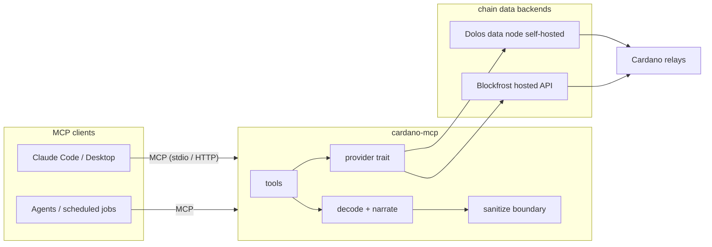

# Architecture

`cardano-mcp` is an [MCP](https://modelcontextprotocol.io) server, written in
Rust, that gives AI agents legible access to the Cardano blockchain. It turns
raw chain data — CBOR, datums, policy IDs, governance actions — into decoded,
bounded, human-readable answers, served as a small set of task-shaped tools.

This document describes what the system is and why it is shaped this way. It
is written to stay true as the code grows; anything speculative is marked as
such.

## Design principles

Everything below follows from five commitments:

1. **Task-shaped tools, not endpoint wrappers.** An agent asks "what did this
   transaction do?", not "GET /txs/{hash}/utxos". The server exposes ~12–18
   tools that answer questions, each doing multiple upstream calls and
   returning a synthesized answer. We deliberately do not mirror any REST
   API's surface.
2. **Decoded output is the product.** Chain data is hostile to comprehension:
   CBOR blobs, hex datums, unresolved policy IDs. Every response resolves
   what can be resolved (token names via CIP-25/68 metadata, datum structure,
   plain-English transaction narratives) before it reaches the agent.
3. **Chain data is attacker-controlled input.** Anyone can write anything
   into on-chain metadata — including text aimed at the LLM reading it
   (prompt injection), oversized blobs (context flooding), and control
   characters. All chain-sourced content passes through a sanitization
   boundary before leaving the server. See [Security model](#security-model).
4. **Capability absence over capability gating.** The default build cannot
   sign or spend — not "is configured not to": the code is excluded at
   compile time. Transaction building ships later as an off-by-default Cargo
   feature producing a separately built artifact.
5. **Self-hostable, provider-agnostic.** The server speaks to the chain
   through one narrow provider interface with interchangeable backends:
   hosted Blockfrost to start (free tier, zero infrastructure), self-hosted
   Dolos for sovereignty (same API shape). Swapping backends is
   configuration, not code.

## System context



Two things are deliberately *outside* the box:

- **Consumers are not components.** Scheduled agents, monitoring jobs, and
  report generators are MCP *clients* that call the tools. The server stays
  stateless and knows nothing about them.
- **The chain infrastructure is not ours.** We never run consensus, never
  index the full chain ourselves, and never reimplement what Dolos/Blockfrost
  already serve. The server is a translation and safety layer, not a node.

## Tool surface (Tier 1 — read-only)

| Tool | Question it answers |
| --- | --- |
| `search` | "What is this string?" — address, tx hash, asset, policy, pool ticker, or handle; routes to the right inspector |
| `inspect_address` | Balance, holdings with resolved names, staking/delegation state, recent activity summary |
| `inspect_transaction` | Plain-English narrative: who paid whom, scripts executed, datums decoded, fees, metadata |
| `inspect_asset` | Token/NFT metadata (CIP-25/68), supply, mint history, holder shape |
| `inspect_policy` | What a policy has minted; script type if resolvable |
| `stake_pool_info` | Pool metadata, performance, saturation |
| `governance_state` | Live governance actions with tallies, DRep voting records, treasury proposals |
| `protocol_state` | Chain tip, epoch clock, protocol parameters |

Exact schemas live in the code; the count stays small on purpose. A tool
earns its place by answering a recurring question, not by existing upstream.

Tier 2 (feature-gated, later): `build_transaction` returning **unsigned** CBOR
plus a plain-English effect summary, and `submit_transaction`. The
build/sign/submit split is a security decision: default deployments construct
and explain transactions but cannot authorize them.

## Anatomy of a request

`inspect_transaction(hash)` end to end:

1. **Fetch** — provider returns the tx: inputs/outputs, mint, certificates,
   metadata, redeemers (one or more upstream calls).
2. **Parse** — Pallas (`pallas-traverse`, `pallas-primitives`) parses
   era-aware structures; datum/redeemer CBOR becomes typed `PlutusData`.
3. **Resolve** — asset IDs resolve to names/decimals via CIP-25/68 metadata;
   addresses classify (payment/script/stake); known deposit/fee patterns
   label themselves.
4. **Narrate** — a renderer turns the resolved structure into a compact
   narrative plus structured fields. Rendering is pure (no I/O), which is
   what makes it unit-testable and fuzzable.
5. **Sanitize** — the boundary applies output ceilings, strips control
   characters, and wraps every chain-sourced string in data delimiters (see
   below). Nothing skips this step.
6. **Respond** — MCP content back to the client.

## Crate layout

A Cargo workspace of small crates, so the architecture boundaries are
enforced by the dependency graph rather than by review discipline:

```
cardano-mcp/
  crates/
    decode/          # Pallas-based parsing, CIP-25/68 resolution, narrators.
                     #   Cargo.toml contains no I/O dependencies — "decode
                     #   does no I/O" is compile-time fact, not policy
    sanitize/        # the output boundary: caps, stripping, delimiting.
                     #   Safe output types are constructible only here
    provider/        # ChainProvider trait; blockfrost HTTP impl
                     #   (dolos is the same API shape -> same impl,
                     #   different base URL; utxorpc gRPC possible later)
    server/          # binary: rmcp wiring, tools, transport, config
  fuzz/              # cargo-fuzz targets; depend on decode/sanitize only
  tests/             # golden tests: recorded fixtures -> expected renderings
```

Guiding split: `server` tools may do I/O but never parse chain data;
`decode` parses but cannot do I/O (the dependency is absent); `sanitize` is
the only path to the outside. CI asserts each crate's dependency allowlist.
`#![forbid(unsafe_code)]` at every crate root.

The `ChainProvider` trait is intentionally narrow — the handful of fetches the
tools need, not a general Cardano client. This is what keeps
"Blockfrost today, Dolos tomorrow" a config change: Dolos serves a
Blockfrost-compatible API, so the primary backend swap is the base URL; any
endpoint gaps get compatibility shims inside the provider, never in tools.

## Security model

Threat model summary (full `SECURITY.md` and threat-model document are the
next planned additions to this repo):

- **Assets:** the provider API key (Tier 1); signing keys exist only in
  Tier 2 builds and never in this repo's default artifact.
- **Hostile:** all chain-sourced data. Treated as attacker-controlled at the
  parse step (Pallas hardening + our caps) and at the output step (the
  sanitize boundary). Specific defenses: length/depth ceilings on decoded
  structures, per-response size budgets, control-character stripping, and
  delimiting — chain-sourced strings are emitted inside explicit data markers
  so a metadata value reading "ignore previous instructions" arrives as
  quoted data, never as prose the model might obey.
- **Semi-trusted:** the MCP client (it gets read-only answers; it cannot make
  the server do more than the compiled tier allows) and the upstream provider
  (it can lie about chain state; self-hosting Dolos — optionally behind your
  own validating node — is the mitigation ladder).
- **Supply chain:** `forbid(unsafe_code)`, `cargo-deny` fail-closed CI,
  SHA-pinned actions, minimal dependencies, signed releases (cosign) with
  SLSA provenance and SBOM.

## Deployment shapes

- **Laptop:** the binary + a free Blockfrost key, MCP over stdio. This is the
  five-minute quickstart and must stay that easy.
- **Self-hosted:** container (distroless, non-root, read-only rootfs) behind
  MCP streamable HTTP, next to a Dolos data node. Reference Helm chart ships
  in-repo; no external dependency remains in the request path.
- The server is stateless (caches are warm-only); scale-out and restarts are
  trivial by construction.

## Non-goals

- Not a wallet; the default artifact holds no keys and cannot sign.
- Not a chain indexer or database — persistence is the backend's job.
- Not a Blockfrost proxy: tools that merely re-expose an endpoint get cut.
- Not multi-chain. Cardano only — depth over generality is the bet.

## Open questions (future ADRs)

- Transaction-builder library for Tier 2: whisky vs CML vs pallas-txbuilder
  (provisional lean: whisky).
- UTxO RPC (gRPC) as a second provider path once self-hosted Dolos is the
  primary backend — worth the dependency only if MiniBF gaps demand it.
- Caching policy: which resolutions (metadata, pool info) are safe to cache
  and for how long.
- Governance data depth: whether DRep voting histories need provider-side
  pagination strategies beyond what MiniBF offers.
